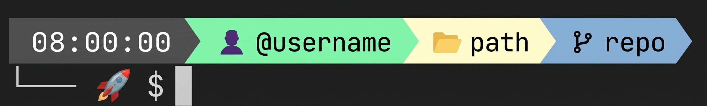

# dotfiles

Personal development environment configuration for **Windows + Git Bash + VS Code**, geared toward Salesforce Commerce Cloud (SFCC) work.

Anything machine- or project-specific (paths, names) lives in a local file that
is **not versioned** (`git-bash/env.local`), so the repository stays generic and
reusable.

## Demo

<p align="center">
  
</p>

## Contents

```
.
├── install.sh                          # Install/link the configuration
├── uninstall.sh                        # Revert the changes
├── git-bash/
│   ├── .bashrc                         # Loader: prompt + local config + aliases
│   ├── git-prompt.sh                   # Custom prompt (Nerd Fonts)
│   └── env.example                     # Local configuration template
└── vscode/
    ├── settings.json                   # VS Code user settings
    ├── snippets/
    │   └── sfcc.code-snippets          # Generic SFCC snippets
    └── workspaces/
        └── sfcc.code-workspace.template # Workspace template (generated on install)
```

## Requirements

- **Git Bash** (Git for Windows).
- **VS Code**.
- A **[Nerd Font](https://www.nerdfonts.com/)** for the prompt (e.g. *JetBrainsMono NF*).
  If you don't use Nerd Fonts, export `USE_NERD_FONTS=false` before loading the prompt for ASCII icons.

## Installation

```bash
git clone https://github.com/salva-sm/dotfiles.git
cd dotfiles
bash install.sh
```

The script:

1. Creates `git-bash/env.local` from `env.example` (if missing).
2. Creates a `~/.bashrc` that loads this repo's configuration.
3. Generates `vscode/workspaces/sfcc.code-workspace` from the template using your variables.
4. Symlinks `vscode/settings.json` and `vscode/snippets/` into your VS Code user folder.

Restart Git Bash when it finishes.

> 💾 **Backups:** any existing `~/.bashrc`, `settings.json` or `snippets` is saved
> to a `.bak` alongside it before being replaced. The backup is made only once, so
> re-running `install.sh` never clobbers your original. `uninstall.sh` restores them.

## Local configuration

Machine-specific values live in **`git-bash/env.local`** (gitignored). Edit it
after the first install:

```bash
# Label VS Code shows for the project folder
export SFCC_PROJECT_NAME="📦 My SFCC Project"

# Path to your project, RELATIVE to vscode/workspaces/
# e.g. project at ~/Github/my-project  ->  ../../../my-project
export SFCC_PROJECT_DIR="../../../my-project"

# Second workspace folder: the Playwright end-to-end test repo.
# Same relative-path rule as SFCC_PROJECT_DIR.
export PLAYWRIGHT_PROJECT_NAME="🎭 Playwright Tests"
export PLAYWRIGHT_PROJECT_DIR="../../../sfcc-playwright-test"
```

The generated workspace opens as a multi-root workspace with both folders (the
SFCC project and the Playwright test repo) and recommends the
`ms-playwright.playwright` extension.

> A `.code-workspace` JSON **cannot** read environment variables in its folder
> `path`, which is why the workspace is **generated** from the template.
> Whenever you change `env.local`, run `bash install.sh` again to regenerate it.

Once generated, the `sfcc` alias (defined in `.bashrc`) opens the workspace:

```bash
sfcc
```

## Uninstallation

```bash
bash uninstall.sh
```

Removes the generated `~/.bashrc` and the VS Code links, restores any `.bak`
backups made at install time, and removes the generated workspace. Your
`env.local` is kept.

## Notes

- The SFCC snippets are generic and reusable in any SFRA project.
- `git-prompt.sh` renders a two-line prompt (date/time, user@host, path, branch).
- On Windows, `ln -s` needs Developer Mode (or an admin shell) to create real
  symlinks; otherwise it falls back to copying the files, which works the same.
