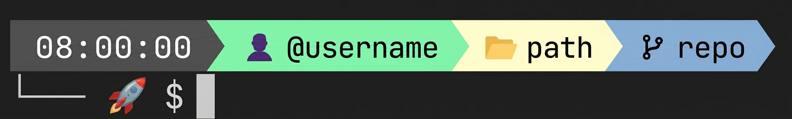

# dotfiles

Personal development environment configuration for **Windows + Git Bash + VS Code**, geared toward Salesforce Commerce Cloud (SFCC) work.

Anything machine- or project-specific (paths, names) lives in a local file that
is **not versioned** (`git-bash/env.local`), so the repository stays generic and
reusable.

## Demo

<p align="center">
  
</p>

## Contents

```
.
├── install.sh                          # Install/link the configuration
├── uninstall.sh                        # Revert the changes
├── git-bash/
│   ├── .bashrc                         # Loader: prompt + local config + aliases
│   ├── git-prompt.sh                   # Custom prompt (Nerd Fonts)
│   └── env.example                     # Local configuration template
├── vscode/
│   ├── settings.json                   # VS Code user settings
│   ├── snippets/
│   │   └── sfcc.code-snippets          # Generic SFCC snippets
│   └── workspaces/
│       └── sfcc.code-workspace.template # Workspace template (generated on install)
└── zed/
    └── settings.json                   # Zed user settings (Ayu Dark theme)
```

## Requirements

- **Git Bash** (Git for Windows).
- **VS Code** or **Zed** (the installer asks which one you use).
- A **[Nerd Font](https://www.nerdfonts.com/)** for the prompt (e.g. *JetBrainsMono NF*).
  If you don't use Nerd Fonts, export `USE_NERD_FONTS=false` before loading the prompt for ASCII icons.

## Installation

```bash
git clone https://github.com/salva-sm/dotfiles.git
cd dotfiles
bash install.sh
```

The script:

1. Creates `git-bash/env.local` from `env.example` (if missing).
2. Asks two questions and saves the answers in `env.local`:
   - **Use the custom prompt (`git-prompt.sh`)?** `yes` / `no` — answering `no`
     leaves Git Bash's own prompt untouched.
   - **Favourite code editor?** `1` VS Code (default) / `2` Zed.
3. Creates a `~/.bashrc` that loads this repo's configuration.
4. Generates `vscode/workspaces/sfcc.code-workspace` from the template using your variables.
5. Symlinks the config of the chosen editor:
   - VS Code → `vscode/settings.json` and `vscode/snippets/` into `%APPDATA%\Code\User`.
   - Zed → `zed/settings.json` (and `zed/keymap.json` if you add one) into `%APPDATA%\Zed`.

Restart Git Bash when it finishes.

Both questions default to your previous answer, so pressing <kbd>Enter</kbd> on a
re-run keeps the current setup. To change your mind, re-run `install.sh` or edit
`DOTFILES_CUSTOM_PROMPT` / `DOTFILES_EDITOR` in `env.local` directly. Answers can
also be piped for an unattended install:

```bash
printf 'no\n2\n' | bash install.sh   # no custom prompt, Zed
```

> 💾 **Backups:** any existing `~/.bashrc`, `settings.json` or `snippets` is saved
> to a `.bak` alongside it before being replaced. The backup is made only once, so
> re-running `install.sh` never clobbers your original. `uninstall.sh` restores them.

## Local configuration

Machine-specific values live in **`git-bash/env.local`** (gitignored). Edit it
after the first install:

```bash
# Label VS Code shows for the project folder
export SFCC_PROJECT_NAME="📦 My SFCC Project"

# Path to your project, RELATIVE to vscode/workspaces/
# e.g. project at ~/Github/my-project  ->  ../../../my-project
export SFCC_PROJECT_DIR="../../../my-project"

# Second workspace folder: the Playwright end-to-end test repo.
# Same relative-path rule as SFCC_PROJECT_DIR.
export PLAYWRIGHT_PROJECT_NAME="🎭 Playwright Tests"
export PLAYWRIGHT_PROJECT_DIR="../../../sfcc-playwright-test"
```

### SFCC OAuth credentials

`SFCC_OAUTH_CLIENT_ID` and `SFCC_OAUTH_CLIENT_SECRET` are optional in
`env.local`. If either one is missing, `.bashrc` reads `client-id` /
`client-secret` from **`$SFCC_PROJECT_DIR/source/dw.json`**. Set `SFCC_DW_JSON`
to use a file elsewhere. Values already exported always win, so nothing in
`env.local` is overwritten.

The generated workspace opens as a multi-root workspace with both folders (the
SFCC project and the Playwright test repo) and recommends the
`ms-playwright.playwright` extension.

> A `.code-workspace` JSON **cannot** read environment variables in its folder
> `path`, which is why the workspace is **generated** from the template.
> Whenever you change `env.local`, run `bash install.sh` again to regenerate it.

Once generated, the `sfcc` alias (defined in `.bashrc`) opens the workspace:

```bash
sfcc
```

With `DOTFILES_EDITOR="zed"` the alias runs `zed` on both project folders
instead, since Zed doesn't read `.code-workspace` files.

## Uninstallation

```bash
bash uninstall.sh
```

Removes the generated `~/.bashrc` and the VS Code / Zed links, restores any
`.bak` backups made at install time, and removes the generated workspace. Your
`env.local` is kept.

## Notes

- The SFCC snippets are generic and reusable in any SFRA project.
- `git-prompt.sh` renders a two-line prompt (date/time, user@host, path, branch).
- On Windows, `ln -s` needs Developer Mode (or an admin shell) to create real
  symlinks; otherwise it falls back to copying the files, which works the same.
